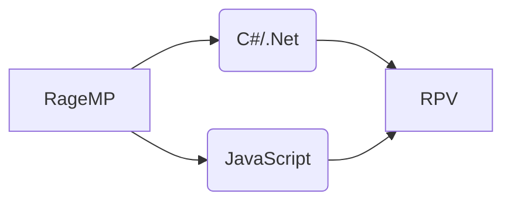

# About

RPV is a custom Grand Theft Auto V: RageMP server, built from the base of Skazi GM, that introduces an immersive and feature-rich roleplaying experience for players. 
This repository contains the source code for RPV, compatible with RageMP version 1.1. 

## Code

## Installation

Step 1: Install [XAMPP](https://www.apachefriends.org/download.html)  
Step 2: Start MySQL and make a new Database  
Step 3: Import s40595_rpvdb.sql into your DB (i use [HeidiSQL](https://www.heidisql.com))  
Step 4: Download  [Visual Studio Code](https://code.visualstudio.com/) and [Visual Studio Community](https://visualstudio.microsoft.com/vs/community/)  
Step 5: Open the gamemode in Visual Studio Code, navigate to Main.cs and change the info for your Database  
Step 6: Open *pvrp.sln* located in dotnet/resources/vrp and build the project  
Step 7: Enjoy 😊  

## Features

RPV is designed to offer players a vast array of features and activities, making the server an exciting and lively environment. Some of the key features include:  

**Jobs**: Players can engage in various legal jobs, such as Bus Driver, Electrician, Fisherman, Food Delivery, and Hacker, to earn an honest living.  
**Illegal Jobs**: For players who prefer a more adventurous path, RPV offers Illegal Hacker and Smuggler jobs, where risk and reward go hand in hand.  
**Businesses**: Players have the opportunity to run their own enterprises, including Banks, 27/7 stores, LS Transit and many more, providing a dynamic economy.  
**Houses and Garages**: The housing system allows players to own homes and store their vehicles safely in garages.  
**Organizations**: Join law enforcement as Police or EMS, or venture into the criminal world with Mafias and Gangs.  
**Events and Quests**: Regularly scheduled events and engaging daily quests keep the gameplay fresh and unpredictable.  
**Admin System**: A comprehensive admin system helps server moderators maintain order and assist players when needed.  
**Inventory System**: Players can manage their belongings, keeping track of items and resources.  
**Vehicle shop and Tunning:** Buy your dream cars and fine tune them as you wish!  

##  Maintenance
Gamemode is currently being activly developed.  
>For any questions or request about the gamemode feel free to join on [DISCORD](https://discord.gg/WANz5A6Ahm)  
